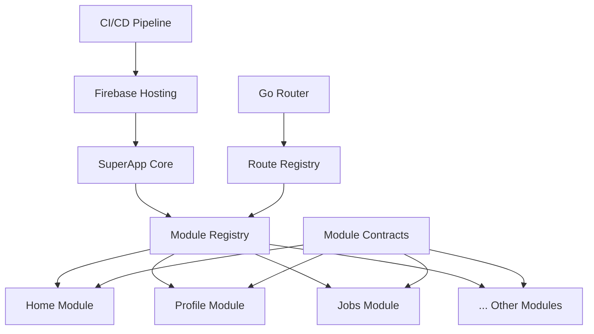

# Architecture Overview

## The Flutter Modular Architecture

The Flutter SuperApp Architecture represents a paradigm shift in cross-platform development, introducing a **module-first approach** that surpasses traditional monolithic applications and even micro-frontend solutions.

## Core Architecture Principles

### 1. **Module Independence**
Each feature module is a self-contained package with:
- Independent dependencies (`pubspec.yaml`)
- Own routing definitions
- Isolated state management
- Separate testing suites
- Individual deployment cycles

### 2. **Contract-Based Communication**
Modules communicate through well-defined contracts, ensuring:
- Type safety across module boundaries
- Backwards compatibility
- Clear API definitions
- Compile-time error detection

### 3. **Dynamic Module Registry**
The core app dynamically discovers and registers modules:
- Automatic route registration
- Module lifecycle management
- Hot-swappable components
- Runtime module loading

## Architecture Diagram



## File Structure Deep Dive

```
superapp/
├── lib/
│   └── main.dart              # Core app entry point
├── modules/                   # Feature modules directory
│   ├── home_module/
│   │   ├── lib/
│   │   │   └── home_module.dart
│   │   └── pubspec.yaml       # Module dependencies
│   ├── profile_module/
│   └── jobs_module/
├── packages/
│   └── module_contracts/      # Shared contracts
│       ├── lib/
│       │   ├── module_api.dart
│       │   └── route_registry.dart
│       └── pubspec.yaml
└── melos.yaml                 # Multi-package management
```

## Module Lifecycle

### 1. **Registration Phase**
```dart
final registry = ModuleRegistry()
  ..register(HomeModule())
  ..register(ProfileModule())
  ..register(JobsModule());
```

### 2. **Route Discovery**
```dart
final routeRegistry = RouteRegistry();
for (final module in registry.modules) {
  module.registerRoutes(routeRegistry);
}
```

### 3. **Navigation Setup**
```dart
final router = GoRouter(routes: routeRegistry.routes);
```

## Key Components

### SuperModule Abstract Class
```dart
abstract class SuperModule {
  String get id;
  String get version;
  String registerRoutes(RouteRegistry registry);
  Future<void> onInit() async {}
  Future<void> onDispose() async {}
}
```

### Route Registry
```dart
class RouteRegistry {
  final List<GoRoute> _routes = <GoRoute>[];
  void add(GoRoute route) => _routes.add(route);
  List<GoRoute> get routes => List.unmodifiable(_routes);
}
```

### Module Implementation
```dart
class HomeModule extends SuperModule {
  @override
  String get id => "home";
  
  @override
  String get version => "0.0.1";
  
  @override
  String registerRoutes(RouteRegistry registry) {
    registry.add(GoRoute(
      path: '/home',
      builder: (ctx, state) => const HomeScreen(),
    ));
    return '/home';
  }
}
```

## Advantages Over Traditional Architectures

### 🏆 **vs. Monolithic Flutter Apps**
- **Scalability**: Add features without affecting existing code
- **Team Collaboration**: Multiple teams can work independently
- **Deployment**: Update individual features without full app deployment
- **Testing**: Isolated testing reduces regression risks

### 🏆 **vs. React Native**
- **Performance**: Native compilation with Flutter's performance
- **Type Safety**: Compile-time error detection vs runtime errors
- **Single Codebase**: True write-once, run-anywhere
- **Module Contracts**: Stronger architectural boundaries

### 🏆 **vs. Ionic/Hybrid Solutions**
- **Native Performance**: No WebView performance penalties
- **Consistent UI**: Platform-consistent design system
- **Better Tooling**: Flutter's superior development tools
- **Smaller Bundle Size**: Optimized native compilation

## Enterprise Benefits

### Development Team Scaling
- **Parallel Development**: Teams work on isolated modules
- **Knowledge Isolation**: Teams can specialize in specific domains
- **Reduced Conflicts**: No merge conflicts between feature teams
- **Independent Releases**: Deploy features when ready

### Technical Advantages
- **Hot Module Replacement**: Update modules without app restart
- **A/B Testing**: Deploy different module versions to user segments
- **Feature Flags**: Enable/disable modules dynamically
- **Graceful Degradation**: App continues working if a module fails

### Business Impact
- **Faster Time-to-Market**: Parallel development reduces delivery time
- **Risk Mitigation**: Module isolation reduces deployment risks
- **Cost Efficiency**: Teams can be right-sized for their modules
- **Competitive Advantage**: Rapid feature development and deployment

## Next Steps

- [Creating Modules](../modules/creating-modules.md) - Build your first module
